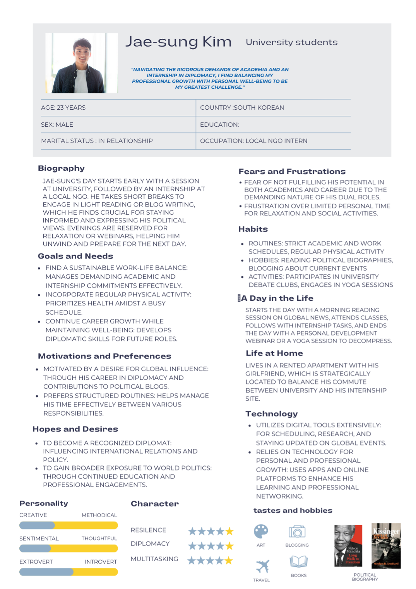
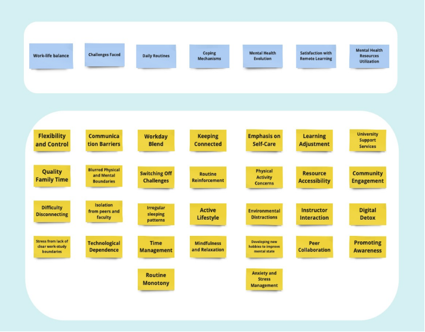
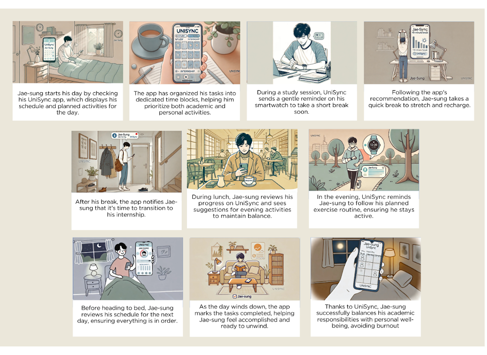
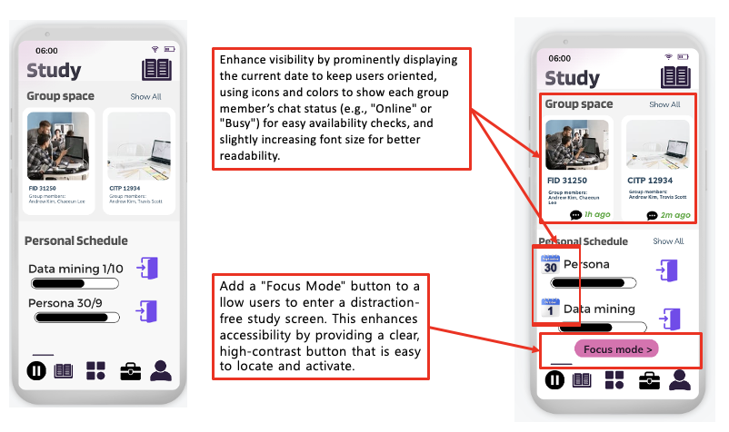
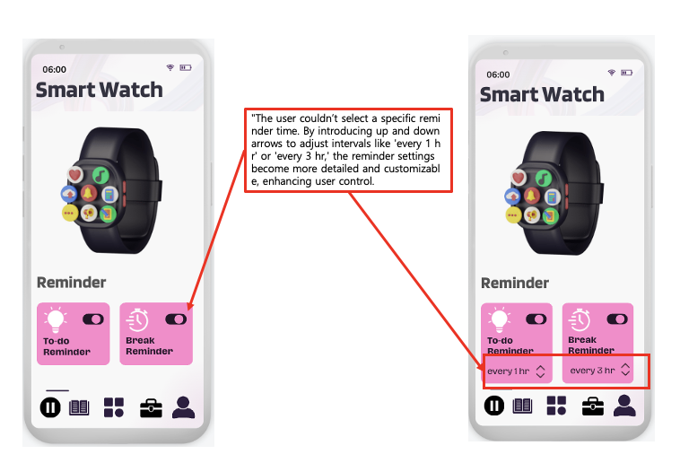
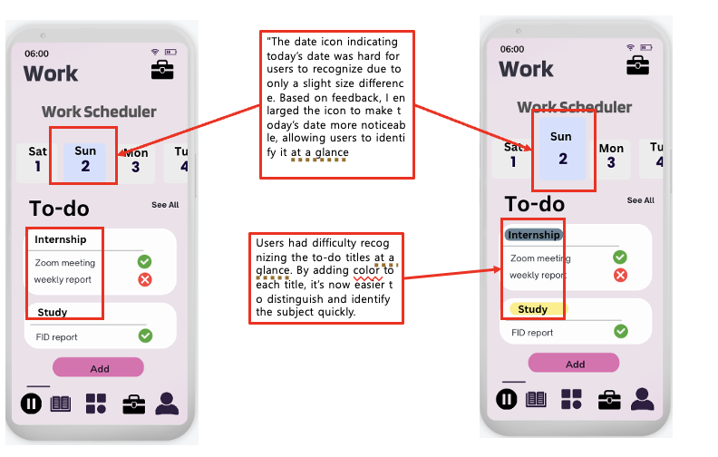

# UniSync – UX Prototype & Usability-Driven Improvement Report

📱 A student-centered scheduling solution blending UX design, data-informed decisions.

---

## 🔍 Overview

**UniSync** is a mobile and smartwatch-integrated app that helps university students balance academic, internship, and personal life.  
This project was completed as part of a university UX design assessment and demonstrates a strong focus on **data-informed product improvement**, **usability testing**, and **strategic design thinking**.

> 🎯 **Project Focus**: Applying UX research + behavioral insight + marketing-style analysis to design better habit-building tools.

---

## 🧠 My Role

| Area | Responsibility |
|------|----------------|
| UX Research | Interview design, persona development, affinity mapping, insight synthesis |
| Usability Testing | Scenario design, heuristic evaluation, documentation |
| Data Interpretation | Turning qualitative feedback into actionable improvement plans |
| Prototype Improvement | Functional redesign, UI adjustments, notification & micro-interaction planning |
| Visual Design | Interface layout & interaction (excluding storyboard drawing) |

> ✏️ Note: This was a team project. I contributed to all components except **the storyboard illustrations**, which were created by another member.

---

## 📊 From UX to Data-Driven Insight

| Insight Area | Description | Design Impact |
|--------------|-------------|----------------|
| ⚡ Behavioral Observation | Students struggled with fragmented routines & overworking | Time-blocking & break reminders were introduced |
| 🎯 Funnel Analysis | Key actions (e.g. "Add task") lacked visual emphasis | Increased CTA visibility & size |
| 🔁 Retention Triggers | Lack of feedback created uncertainty | Added micro-interactions (toggle color, emoji confirmation) |
| 📈 Measurable Impact | Visibility & ease-of-use tested via user feedback | Revisions improved navigation, clarity & confidence |

---

## 🧩 User Research Summary

- **Key Problem**: Students reported poor time control, frequent burnout, and difficulty maintaining wellness.
- **Method**: Qualitative interviews with 10 students + affinity diagram clustering
- **Outcome**: A shared need for:
  - Clear study/life boundaries
  - Personalized routines
  - Cross-device notifications

---

## 👤 Persona Highlight

- **Name**: Jae-sung Kim (23, Political Science major)
- **Challenge**: Balancing internship + study + self-care
- **Needs**: Predictable routine, reminder cues, self-reflection space

---

## 🧠 Affinity Diagram

Clustering feedback from 10 participants revealed pain points around:
- Stress from blurred boundaries
- Constant digital overload
- Lack of routine → Reduced motivation

---

## 🎬 Storyboard

Illustrates how Jae-sung uses UniSync to build and maintain a healthier daily routine using smart notifications and guided transitions.

---

## 🛠️ UX Prototype Highlights

- 📄 [Full Report (PDF)](./report/AT3_Paper_Prototype_ChaeeunLee.pdf)  
- 🎨 [Interactive Prototype (Canva)](https://www.canva.com/design/DAGT6hdCq7E/YWKZBVU88yZmknVUqKIDag/view?mode=prototype)  
- 📽️ [Usability Test Video](https://youtu.be/XuhOp8Ts1Dk?si=OYZP651YPFAymwl1)

### Visual Improvements

| Area | Screenshot |
|------|------------|
| 📚 Study Interface |  |
| ⌚ Smartwatch Reminders |  |
| 🗓️ Work Scheduler UI |  |

---

## 🔍 Heuristic Evaluation Summary

| Issue | Violated Heuristic | Fix Implemented |
|-------|--------------------|------------------|
| Icons lacked clarity | #7: Recognition vs Recall | Added text labels |
| Toggles gave no feedback | #1: Visibility of Status | Added visual cue |
| Add button too small | #9: Efficiency of Use | Enlarged button |
| Mood tracker had no save message | #8: Error Recovery | Added “Saved” confirmation |

---

## ✅ Final Improvements

- 📌 Increased visibility of key actions (“Add task”, “See All”)
- 🔔 Added haptic or visual feedback for toggles & reminders
- 💬 Added motivational feedback on progress tracking
- 📈 Improved touch zones for smaller screens

---

## 🎯 Strategic Value of This Project

This case study reflects a mix of **UX design execution** and **strategic insight generation** — applicable to marketing, behavior-based design, and analytics roles.

| Skill | Demonstrated Through |
|-------|------------------------|
| Behavioral Insight Analysis | Interview + Affinity synthesis |
| Funnel Thinking | Improving action visibility & conversion |
| Micro-feedback Strategy | Added cues to reduce user dropout |
| Prioritization Logic | Focused on retention-prone moments |
| User Engagement Techniques | Routine-building, personalization, reminders |

---

## 🙋‍♀️ About Me

| Field | Detail |
|-------|--------|
| Name | Chaeeun Lee |
| Email | chaeeun.lee@student.uts.edu.au |
| Focus | UX Strategy · Data Insight · Behavioral Design · Marketing Tech |
| Summary | I build products where empathy meets analytics — where insight leads to action. |

---

> 💬 This project isn't just a prototype—it's an example of turning **qualitative insight into measurable UX improvement**, with strategic thinking applicable to both design and marketing analytics teams.

